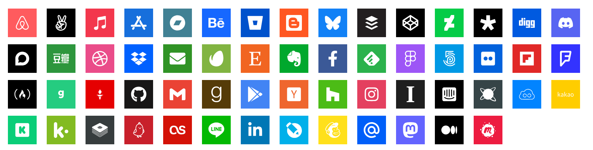
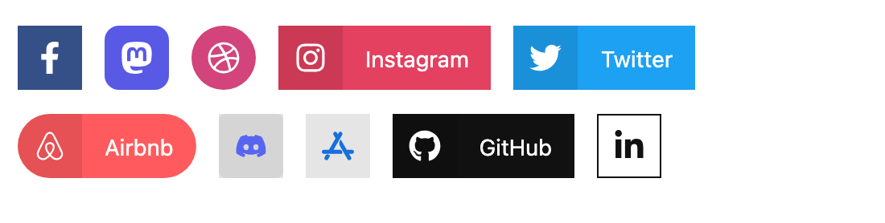

<!-- feature-intro -->
Make social buttons easier to build in Craft. Generate profile and sharing links with bundled icons and brand details, fetch provider-supported counts and extend the catalogue when a project needs something specific.
<!-- feature-intro-end -->

<!-- feature-section media-shadow="false" -->
## 80+ social providers

Use bundled SVG icons and brand colours without carrying the same assets and CSS from project to project. Social Share covers a broad provider catalogue while keeping the surrounding markup and styling in your templates.

<!-- feature-section-end -->

<!-- feature-grid -->
- :icon[chart-bar] **Share counts** Fetch the number of times a URL has been shared when the provider supports it.
- :icon[users] **Follower counts** Display the audience size for a social account through supported provider APIs.
- :icon[share-2] **Share dialogs** Generate provider-ready sharing links so visitors can share the current page or another URL.
<!-- feature-grid-end -->

<!-- feature-section media-shadow="false" -->
## Button generators

Create polished social buttons without coding each treatment from scratch. Generator helpers combine provider destinations, icons, labels, shapes and familiar brand colours, with options to tailor the result to the design.

<!-- feature-section-end -->
